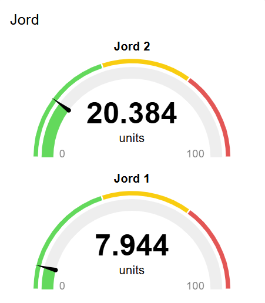

# Monitor outdoor plants with an IoT device

**Author**: Dan-Håkan Davall (id: dd222mk)

**Time to complete build**: 3-5 days

> [!NOTE]
> Some text is copied from one of last years (2024) students who did something wery similar to my project. I have updated the sections that differs but he should have credits for doing the time consuming work with the tabel of components and materials used in the project and for some of the backgrund information. 

My project can be found [here](https://github.com/egsdandd/Sommar25)

This tutorial walks through the steps of making a simple IoT-device that can monitor temperature and humidity of the environment around your plants. This tutorial was made as an assignment to a [IoT-course](https://lnu.se/en/course/introduction-to-applied-internet-of-things/distance-international-summer/) at Linnaeus University. The project takes about 5 days to build and maybe 2 extra for setting up the digital infrastructure. It all depends on how comfortable you are with programming and if you have self-hosted services before.

> [!IMPORTANT]
> This tutorial assumes you have a basic knowledge of the concept of Internet Of Things (IoT). If not, here is a list of things you should do further reading on before preceding:
> - [ ] What even is [IoT](https://www.oracle.com/internet-of-things/what-is-iot/) ?
> - [ ] Basics in [computer networking](https://www.ibm.com/topics/networking).
> - [ ] The [MQTT](https://mqtt.org/) protocol.
> - [ ] What is a [server](https://en.wikipedia.org/wiki/Server_(computing))?
> - [ ] *Optional*: [Basic](https://www.instructables.com/Basic-Electronics/) electronics.

# Table of contents
- [Monitor outdoor plants with an IoT device](#monitor-outdoor-plants-with-an-iot-device)
- [Objective](#objective)
- [Table of contents](#table-of-contents)
- [Material](#material)
  - [Components needed for building the environment-sensor.](#components-needed-for-building-the-environment-sensor)
  - [Materials for the IT-infrastructure](#materials-for-the-it-infrastructure)
- [Computer setup](#computer-setup)
  - [Step 0: install needed packages and programming languages](#step-0-install-needed-packages-and-programming-languages)
  - [Step 1: VS Code](#step-1-vs-code)
    - [Step 2: update/install the firmware on your Pico](#step-2-updateinstall-the-firmware-on-your-pico)
    - [Step 3: uploading the code to the Pico](#step-3-uploading-the-code-to-the-pico)
- [Putting everything together](#putting-everything-together)
    - [The soil hygrometer](#the-soil-hygrometer)
    - [The temperature & humidity sensor](#the-temperature--humidity-sensor)
    - [The internal temperature sensor](#the-internal-temperature-sensor)
    - [The buzzer (optional)](#the-buzzer-optional)
- [Platform](#platform)
- [The code](#the-code)
- [Transmitting the data / connectivity](#transmitting-the-data--connectivity)
- [Presenting the data](#presenting-the-data)
- [Finalizing the design](#finalizing-the-design)
- [Acknowledgements](#acknowledgements)
- [License](#license)
- [Disclaimer](#disclaimer)

# Objective

The inspiration for this project came to me as a result of spending most of my summer at our summer house and then leaving our home unattended. I do have a watering system in place that runs on a schedule and I am also monitoring the waterflow in case ther should be a problem with the piping. However living in Sweden close to the coast you can never predict how much rain that will fall locally. I then decided to measure the humidity around the plants and based on that change the watering schedule. I also included a device to measure the air temperature and humidity and also the actual temperature of the device itself since it will be installed in some kind of box.


*Figure 1: The outdoor plants*

Hopefully this data helps me understand how much water my plants get and adjust the watering schedule accordingly. I also wanted to make a device that is easy to build and can be used in other projects. The device is built around a Raspberry Pi Pico W microcontroller which has built in WIFI and Bluetooth. The code is written in MicroPython and the data is sent over MQTT to a self-hosted MQTT broker on my home network. The data is then stored in an MongoDB database and visualized with Node-RED.

# Material

> [!NOTE]
> The materials I used in the project is included in teh basic pack recomended for the course but i bougt the 2 soil sensors separatly. I realize now that the project can be a bit expensive if you have to buy all of these things at once, especially the Raspberry Pi. Just note that the Raspberry can host a  lot of stuff and be used in multiple projects at once! You probably won't regret buying one!

### Components needed for building the environment-sensor.

| Name                                         | Picture                                                                              | Where to buy                                                                | Amount | Price (as of 2024-06-25) | Used for                                                                      | Note                                                                                                              |
| -------------------------------------------- | ------------------------------------------------------------------------------------ | --------------------------------------------------------------------------- | ------ | ------------------------ | ----------------------------------------------------------------------------- | ----------------------------------------------------------------------------------------------------------------- |
| Raspberry Pi Pico W                          |  | [Link](https://www.electrokit.com/en/raspberry-pi-pico-w)                   | 1 pcs  | 89 SEK                   | Microcontroller who runs the code. Has built in WIFI and Bluetooth            | You can use another micro controller if you want to. But I can't promise the rest of this tutorial will help you. |
| Soil hygrometer module                       |            | [Link](https://www.electrokit.com/en/jordfuktighetssensor)                   | 2 pcs  | 29 SEK                   | Sensor for measuring the moisture level in soil           | You can use another sensor if you want to. But that might require changes in the code. |
| Digital temperature and humidity sensor DHT11 |            | [Link](https://www.electrokit.com/digital-temperatur-och-fuktsensor-dht11)  | 1 pcs  | 49 SEK                   | Self-explanatory                                                              |                                                                                                                                        |
| LED 3mm red low current 2mA TLLR4401         |  | [Link](https://www.electrokit.com/led-3mm-rod-lagstrom-2ma-tllr4401)        | 1 pcs  | 9 SEK                    | Used as an indicator                                                          |                                                                                                                   |
| 330 ohm resistor                           |  | [Link](https://www.electrokit.com/en/motstand-1w-5330ohm-330r7)                 | 1 pcs  | 3 SEK                    |                                                                               | Any 330ohm resistor works                                                                                       |
| Wires male-to-male                           |            | [Link](https://www.electrokit.com/labbsladdar-100mm-hane/hane-30-pack)      | 30 pcs | 39 SEK                   |                                                                               | Your layout on the breadboard is up to you. But you will probably not need more than 30 wires                     |
| Breadboard                                   |            | [Link](https://www.electrokit.com/kopplingsdack-840-anslutningar)           | 1 pcs  |    69 SEK                      | For connecting everything                                                     | What I recommend. Should be plenty of room.                                                                       |
| Buzzer **(optional)**                        |            | [Link](https://www.electrokit.com/summer-4-khz-miniatyr)                    | 1 pcs  |  28.45 SEK                        | Used as an indicator                                                          | An extra sound indicator.                                                                                         |

### Materials for the IT-infrastructure

> [!NOTE]
> In this project I have chosen to self-host everything. To host the servers, you are going to need a computer on your network that is running at all times. More precisely in this tutorial, a computer running a [Linux OS](https://en.wikipedia.org/wiki/Linux). I have chosen to host my project on a Raspberry Pi 3b+ I had laying around. If you do not already have a computer hosting stuff on your network, buying a Raspberry Pi is what I recommend.

| Part             | Picture                                                                                | Where to buy                                                                         | Amount | Price (as of 2025-07-03) | Note                                                                                                                                                                                       |
| ---------------- | -------------------------------------------------------------------------------------- | ------------------------------------------------------------------------------------ | ------ | ------------------------ | ------------------------------------------------------------------------------------------------------------------------------------------------------------------------------------------ |
| Raspberry Pi 3b+ |        | [Link](https://www.electrokit.com/raspberry-pi-3-1gb-model-bplus)                    | 1 pcs  | 479 SEK                  | What I've used. There are newer models and other brands work as well. Have built in WIFI.                                                                                                 |
| SD-card 16 GB    |  | [Link](https://www.electrokit.com/minneskort-microsdhc-16gb)                         | 1 pcs  | 89 SEK                  | Used for hosting the OS and long term memory. 16 GB should be plenty for this project. If you are planning on hosting other stuff on your raspberry you can buy SD-card with more storage. |
| Power supply     |    | [Link](https://www.electrokit.com/raspberry-pi-4-stromforsorjning-5v-3a-usb-c-svart) | 1 pcs  | 149 SEK                   | Something like this. Any power supply rated the same works.                                                                                                                                |
# Computer setup

The Pico W is the heart of the IoT-device and runs all the code and also sends the messages over the network. The Pico can be programmed with a lot of different programming languages. In this project the code is implemented in the language [MicroPython](https://micropython.org/). To write the program and write the code to the Pico [Microsoft’s Visual Studio Code](https://code.visualstudio.com/)  was used as the preferred [IDE](https://www.codecademy.com/article/what-is-an-ide). **Down below are the steps for getting started with writing code to your Pico if you are using Windows on your PC. The rough steps are the same if you using MAC.**  If you get stuck, do not be afraid to google around for help. There are a lot of helpful tutorials out there on the internet!

> [!Important]
> If you are using Linux on your personal computer the steps for downloading and installing the packages can be made mostly from the terminal. If you are using Linux - I assume you know what you are doing and can manage yourself 😉

### Step 0: install needed packages and programming languages

* We are going to use a plugin in VS Code that is dependent on Nodejs. Got to [this](https://nodejs.org/en/) website and download it. Run the downloaded file and follow the instructions in the installer.
* After flashing the Pico (which we will do later), MicroPython is supported natively on the Pico. However, if you want to run the code on your own computer first for testing purposes, you are going to need to install Python on your computer. Python can be downloaded and installed from [here](https://www.python.org/downloads/).

### Step 1: VS Code

* Got the official [download page](https://code.visualstudio.com/) for VS code and download the version for your specific OS . Run the downloaded file and follow the steps in the installer.
* To write the code to the Pico we are going to use an extension in VS Code that is called *MicroPico*. Go to the extensions tab in VS Code and search for *MicroPico* and install the first extension that shows up in the results.

### Step 2: update/install the firmware on your Pico

We are now going to install the right firmware to the Pico so we can program it with MicroPython. This can be a bit tricky if you never done it before. I recommend watching a video of someone else doing it first. Download the firmware form [this](https://micropython.org/download/RPI_PICO_W/) website. Have your Pico and a USB cable for connecting it to your computer ready. Then do the following:

1. Connect the USB cable to the Pico. **Do not connect the cable to your computer yet!**
2. While holding down the *BOOTSEL* button on your Pico, connect the other end of the USB cable to your computer. The Pico should show up on your computer as a regular USB drive. You are now allowed to release the BOOTSEL button.
3. Drag and drop the *.uf2* file you downloaded previously to the Pico. When the file is transferred the Pico will automatically disconnect itself.

> [!Important]
> If everything went well the Pico should automatically disconnect itself from the computer! If it did not, somethings went wrong and you will have to repeat the steps above. 
Press the SHIFT-CTRL-P and search for MicroPico connect. Click on it and you should se a text in the lower left corner in VSC that the device is connected. Study the options to the right of the connection message.

### Step 3: uploading the code to the Pico
Well done! We are now ready to upload the code to the Pico. I recommend you to play around with your Pico and try to write your own code and upload it. Then download the code with the MicroPico extension.

When you are feeling confident in writing code to the Pico, clone the GitHub repository to your computer and open the folder in VS Code.

#### Variables in the code

Before writing the code to your Pico you are going to need to change some variables. In the *config.py* file, under fill out yor information:

ssid = "MyWifiNetwork", 
password = "MyWifiPassword", 
mqtt_user = "mqttuser", 
mqtt_password = "mqttpassword", 
mqtt_server = "mqtt_server_ip"

The *ssid* and *password* variables are the name and password of your WIFI network. The *mqtt_user* and *mqtt_password* are the username and password for your MQTT broker. The *mqtt_server* is the IP address of your MQTT broker. If you are using a Raspberry Pi, this is probably the IP address of your Raspberry Pi.

The Pico is going to be connect to your WIFI and MQTT broker.

You are also free to change the mapping of the pins if you want to. But in the rest of the tutorial, I am going to assume you do not.

When everything set you are good to upload the code to the Pico.

> [!TIP]
> I have programmed the built in LED on the Pico as an indicator:
> - Constant light = No WIFI/trying to connect to WIFI
> - Flash = sent data to MQTT broker
>
> So, it should go something like this when you connect your Pico to the power supply: The LED turns on and stays on for a few seconds, then the LED turns off and starts to flash every every time the data is ent to the brooker.
>
> Have the Pico connect to a terminal while setting up the sensor. Useful information about its state is printed to the terminal. Such as the connection to the WIFI or if a sensor is not connected properly.

# Putting everything together


*Figure 2: Connecting*

The whole device can be split in 4 parts: The **Pico**, the **soil hygrometer**, the **temperature and humidity sensor** and the **buzzer**. I am not going to provide a diagram that shows you exactly where to put things on the breadboard; as it would be too messy. 

> [!CAUTION]
> Always disconnect the power supply when connecting the electronics together! Sudden changes in voltage and current can damage the components!

### The soil hygrometer

The soil hygrometer is a simple sensor that measures the moisture level in the soil. It has two pins: GROUND and SIGNAL. The sensor is connected to a small printed circuit board (PCB) with 4 pins (we are only using the GROUND, VCC and SIGNAL pins) that connects to the Pico as follows:
* Connect the VCC pins to the Picos **GP15** .
* Connect the GROUND pins to one of the Picos ground pins.
* Connect the SIGNAL pins to **Pin 28/27** on the Pico.
* The sensor is powered by the Pico, so you do not need to connect the power pin to anything.

### The temperature & humidity sensor

This one is very straight forward. The DHT11 sensor has 3 pins: GROUND, POWER and SIGNAL. Study the data sheet from where you bought it to figure out which is which.

* Connect GROUND pin to one of the Picos ground pins.
* The POWER pin to the Picos 3.3 V power supply.
* The SIGNAL pin to **GP 11** on the Pico.

### The internal temperature sensor

The internal temperature sensor (ADC4) is powered by the Pico, so you do not need to connect the power pin to anything.

### The buzzer (optional)

The buzzer generates a tone when the sunshine is too bright.

* Connect one pin to ground
* Connect the other to **Pin 5** on the Pico.

If you do not want the buzzer, you can just skip this step.

# Platform

As mentioned before, the whole solution is self-hosted on a Raspberry Pi on my own network. Mostly because I care about privacy. I wanted to make it easy for myself and searched the web for a pre made [docker-compose](https://docs.docker.com/compose/) MQTT-brooker called Mosquitto ( I use eclipse-mosquitto ) that can be used in my project with Docker-Compose. 

There are many others to choose from and another example is [this](https://learnembeddedsystems.co.uk/easy-raspberry-pi-iot-server) tutorial which can be used, if preferred:  The tutorial is using [this](https://github.com/SensorsIot/IOTstack) GitHub repository for installing the stack. The repository comes with a bash script that automatically builds the docker-compose yml file for you! The bash script also has options for backing up your data.

I choosed to install my own on my Raspberry Pi as it is good learning experience. The stack consist of:

* [Mosquitto](https://mosquitto.org/) (Docker based MQTT Broker - eclipse-mosquitto )
* [MongoDB ](https://www.mongodb.com/) (Docker based Database - mongodb/mongodb-community-server:4.4.3-ubuntu2004, this is an old version that is EOL but worked for me )
* [Node-red](https://nodered.org/) (programming tool for connecting devices. In this case the MQTT Broker with the MongoDB Database). This I installed plain even though it is available as a docker image.
* [Node-red-desktop](https://nodered.org/)  (For visualizing the data I use rev 2.0.0 of the dashboard)

> [!IMPORTANT]
> You are going to need to assign a static IP address for your Raspberry Pi in your WIFI router. The process is different depending on what brand your router is. Search the web for your router brand and how to set up a static IP address.

> [!TIP]
> I have hosted a lot of stuff on different Raspberrys before and have the infrastructure already set up. If it is your first time, I recommend watching a tutorial on how to set up a Raspberry with a simple web server. And maybe also on how to use docker-compose. Here is a good [video](https://www.youtube.com/watch?v=jLff_K39qL4) for getting started with a fresh Raspberry Pi.

# The code

The code on the Pico is very simple. Half of the lines in the [*main.py*] file is mostly importing libraries and setting up constants. The reason the code is so small is because of the extensive use of libraries. The DHT11 library (which comes with MicroPython) makes the collecting of the data from the DHT11 sensor as easy as just running a function - no need for setting up communications with the sensor yourself. The *umqttsimple* library, found in the [*umqtt*] folder, manages all the communication with the MQTT protocol. To set up WiFi/MQtt and the loggingfunctionality I used the [*network*](https://docs.micropython.org/en/latest/library/network.html) and [*logging*](https://docs.micropython.org/en/latest/library/logging.html) libraries that come with MicroPython. The code is written in a way that it can be easily extended to include more sensors or features.

I have divided my code in smaller modules according to this:


*Figure 3: Github*

I think it should be easy to understand the functionality of each file. Note - config.tmpl is just at template and You need to change it and rename it to config.py
The reading of the soil sensurs are done 5 times in a row and the an average is calculated out of these reads.

I would describe the code as consisting of 3 main functions/sections:

- the `connect_to_wifi() and disconect_wifi` functions
- the `connect_to_mqtt()` function
- and the *main while loop*

Down below is the main loop that runs indefinitely. I think the code is pretty straight forward, so I will not go through it step by step. But I am going to make some small remarks. I made sure that the code does not crash or halt if anything goes wrong. Notice the extensive use of try-catch blocks. If the device loses WIFI connecting it will enter another loop in the `connect_to_wifi()` function that tries to connect to the WIFI every 10 seconds. If the `gather_data()` function fails, maybe due to a sensor being disconnected, the code prints an error message and sends a message to the MQTT topic */collecting* or */other* - depending on if the error occurred collecting data or because of something else.

```Python
# THE MAIN LOOP
    while True:
        try:
            ADC_temperature, ADC_calibrated_temperature, ADC_voltage = read_calibrated_temperature() # Read and calibrate temperature from ADC
            if ADC_temperature is None or ADC_calibrated_temperature is None:
                Log("Failed to read temperature from ADC", "ERROR")
                continue  # Skip to the next iteration if reading fails

            print("ADC calibrated Temperature:", ADC_calibrated_temperature, "°C") 

            temperature, humidity = read_DHT22() # Read temperature and humidity from DHT22 sensor

            moist = plant_Monitor(sensorVCC,[soil_Sensor1,soil_Sensor2]) # Read soil moisture levels for both plants
            if moist is None or len(moist) < 2:
                Log("Failed to read moisture levels from sensors", "ERROR")
                continue
            plant_Left_Moist_Level = moist[0] # Get moisture level for left plant
            plant_Right_Moist_Level = moist[1] # Get moisture level for right plant
            print("Plant Left Moisture Level:", plant_Left_Moist_Level, "%")
            print("Plant Right Moisture Level:", plant_Right_Moist_Level, "%")

        except Exception as e: # Handle any exceptions that occur during sensor reading
            print("Sensor read failed:", e)
            
            time.sleep(300) # Wait for 5 minutes before retrying
            continue
        try:
            connect_wifi()  # Connect to Wi-Fi
            time.sleep(1)  # Wait for Wi-Fi to stabilize
            if not is_connected():  # Check if Wi-Fi is connected
                Log("Not connected to Wi-Fi...connecting", "INFO")
                print("Connecting to Wi-Fi...")
                connect_wifi()  # Connect to Wi-Fi

    
            FlashLed(2)  # Flash LED to indicate data read
            #Buzzer(1)
            # Publish data to MQTT broker
            client.publish("egsdand/feeds/picow_temp", str(temperature))
            client.publish("egsdand/feeds/picow_hum", str(humidity))

            client.publish("egsdand/feeds/moisture1", str(plant_Left_Moist_Level))
            client.publish("egsdand/feeds/moisture2", str(plant_Right_Moist_Level))

            client.publish("egsdand/feeds/adc_calibrated_temp", str(ADC_calibrated_temperature))

            print("Data published successfully")
            # Buzzer(2)
            disconnect_wifi() # Disconnect from WIFI

        except Exception as e: # Handle any exceptions that occur during MQTT publishing
            print("MQTT publish failed:", e)
            Log(f"MQTT publish failed: {e}", "ERROR")

        time.sleep(120) # Wait for 2 minutes before the next iteration
        # Free up memory
        gc.collect()  # Collect garbage to free up memory
```

# Transmitting the data / connectivity

Down below is a graph that describes how the whole project is connected together. The data from the DHT11 sensor is sent over a proprietary protocol managed by the DHT11 library using a physical wire. The soil sensors works the same way. The Pico sends the environment data every 120 seconds over WIFI using the MQTT protocol to the brooker. The router forwards the message from the Pico to the Raspberry Pi where the Mosquito MQTT broker listens on that port. The data then takes this path:

Sensors --> Pico --> MQTT-broker (Docker hosted on the Pi) --> Node-Red (hosted on the Pi) --> MongoDb (Docker host) --> Node-Red-Dashboard

Node-red pushes the data to the MongoDB Database and Node-Red-Dashboard to view the diagrams. The Node-Red-Dashboard reads long time data from MongoDB and displays it in a separate chart.

# Presenting the data

The data is visualized with a dashboard in [Node-Red](https://nodered.org/). My dashboard consists of two sections. One for the real time data - showing the temperature and humidity right now and the status of the 2 soil meters. The other section shows the data over time.

The data is sent to the database after every read from the sensors. I did a rough calculations and the amount of storage space the data will take up. In my lifetime it will never succeed the capacity of my Pi GB. So, the data is stored forever.

The long time data is updated with the help of a node-red inject node that trigger a read of the last record from the database.



*Figure 4: The dashboard in Node-Red for the soil sensors*


*Figure 5: The dashboard in Node-Red for the DHT11 and Pico internal sensor*

# Finalizing the design

Thinking back on the project it went very well after becomming familiar with the Pico pin-out. I had some trouble making the moister sensors work at first but after some debbuging it was working fine.

There is still room for improvement. I had some issues with the Node-Red disconnecting from the server every now and then. The dashboard could use some redesign and the output from the database could also be neater. The finilized casing for outdoor use remains to be solved and made waterproof.

Raspberry PI 3+ (and 4) are old by now and I would recommend investing in a Raspberry 5 that will allow updating the database to a more updated version. 

In a future release I will focus on battary savings actions and also include a solar cell charger for the power pack the will be used to power the sensors. The only battery saving actions that are implemented is that i turn WiFi on and of when there is adata to e sent to the MQTT broker. WiFi is by far the device that draw most power. Estitmated time period to measure in the real life would be in the timespan of 60-120 minutes.

# Acknowledgements
I want to thank my teacher and TA:s from the course for their guidance and support throughout this project.
# License
This project is licensed under the [MIT License](https://opensource.org/licenses/MIT). Feel free to use it for your own projects, but please give credit where credit is due.
# Disclaimer
This project is for educational purposes only. I am not responsible for any damage or issues that may arise from using this project.
The code is provided "as is" without warranty of any kind, either express or implied. Use it at your own risk.
The hardware components used in this project are not waterproof and should not be exposed to water or moisture. Use at your own risk.
The project is not intended for commercial use and should not be used as such.